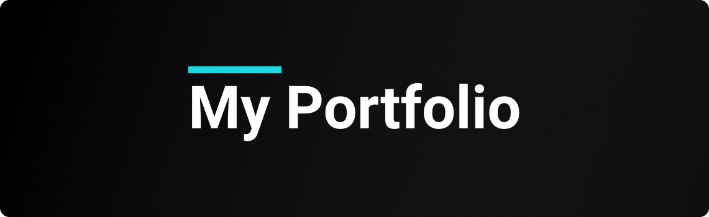

  

  
  
  
    
   
  

<h1 align="center">
    
</h1>

<h4 align="center"> 
	🚧 Aplicação em desenvolvimento! 🚧
</h4>

## 🏁 Tópicos

 👉<a href="#-sobre-o-projeto" style="text-decoration: none; "> Sobre</a>  
👉<a href="#-funcionalidades" style="text-decoration: none; "> Funcionalidades</a>  
👉<a href="#-layout" style="text-decoration: none"> Layout</a>  
👉<a href="#-como-executar-o-projeto" style="text-decoration: none"> Como executar</a>  
👉<a href="#-tecnologias" style="text-decoration: none"> Tecnologias</a>  
👉<a href="#-autor" style="text-decoration: none"> Autor</a>  
👉<a href="#user-content--licença" style="text-decoration: none"> Licença</a>

## 💻 Sobre o projeto

😁 Meu portfólio pessoal.

---

## ⚙️ Funcionalidades

---

## 🎨 Layout

---

## 🚀 Como executar o projeto

---

## 🛠 Tecnologias

---

## 🦸‍♂️ **Autor**

 
  
 <strong>🌟 Guilherme Rocha Vieira 🌟</strong>

---

## 📝 Licença

Este projeto esta sobe a licença [MIT](./LICENSE).

Feito com :satisfied: por Guilherme Rocha Vieira 👋🏽 [Entre em contato!](https://www.linkedin.com/in/grochavieira/)

---
